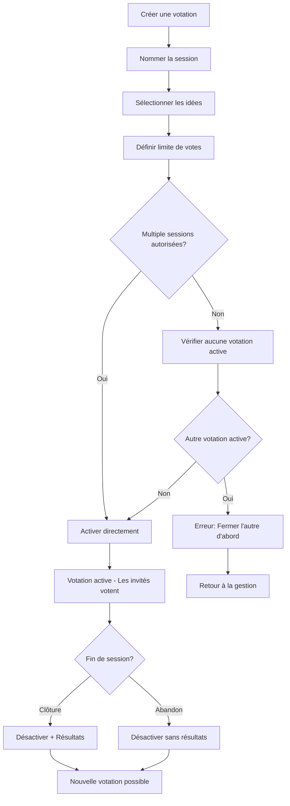

# Documentation Complète - Application Boîte à Idées

## 📋 Description de l'Application

**Idea Box** est une plateforme collaborative moderne conçue pour faciliter la collecte, la gestion et l'évaluation d'idées au sein d'une organisation. L'application permet aux équipes de soumettre des propositions, de voter pour les meilleures idées et de suivre leur progression grâce à un système de gestion par rôles hiérarchiques.

### Objectifs de l'Application

- **Centraliser** la collecte d'idées dans l'organisation
- **Structurer** le processus d'innovation avec des sessions d'émission et de vote
- **Faciliter** la collaboration entre les équipes
- **Tracer** les activités et décisions prises
- **Mesurer** l'engagement et la participation des utilisateurs

---

## 🏗️ Modèle Conceptuel de Données

### Vue d'Ensemble du Système

L'application s'articule autour de **8 entités principales** avec des relations bien définies :

```
┌─────────────────┐     ┌─────────────────┐     ┌─────────────────┐
│      USER       │────▶│     SUBJECT     │◀────│      IDEA       │
│                 │     │                 │     │                 │
│ • ID            │     │ • ID            │     │ • ID            │
│ • Email         │     │ • Nom           │     │ • Subject_ID    │
│ • Nom/Prénom    │     │ • Description   │     │ • User_ID       │
│ • Mot de passe  │     │ • Superadmin_ID │     │ • Titre         │
│ • Rôles[]       │     │ • Gestionnaires │     │ • Description   │
│                 │     │ • Utilisateurs  │     │ • Date création │
│                 │     │ • Émission actif│     │                 │
└─────────────────┘     └─────────────────┘     └─────────────────┘
         │                        │                        │
         │                        │                        │
         │               ┌─────────────────┐               │
         │               │  SUBJECT_STATE  │               │
         │               │                 │               │
         │               │ • Subject_ID    │               │
         │               │ • Is_Activated  │               │
         │               └─────────────────┘               │
         │                        │                        │
         │               ┌─────────────────┐               │
         │               │    VOTATION     │               │
         │               │                 │               │
         │               │ • ID            │               │
         │               │ • Subject_ID    │               │
         │               │ • Nom           │               │
         │               │ • Ideas_List[]  │               │
         │               │ • Vote_Limit    │               │
         │               │ • Is_Activated  │               │
         │               │ • Multiple_Act  │               │
         │               │ • Created_At    │               │
         │               │ • Activated_At  │               │
         │               │ • Closed_At     │               │
         │               └─────────────────┘               │
         │                        │                        │
         │               ┌─────────────────┐               │
         │               │      VOTE       │               │
         │               │                 │               │
         │               │ • Votation_ID   │               │
         │               │ • Idea_ID       │               │
         │               │ • User_ID       │               │
         │               │ • Created_At    │               │
         │               └─────────────────┘               │
         │                                                 │
         │                        ▼                        │
         │              ┌─────────────────┐                │
         │              │  ACTIVITY_LOG   │                │
         │              │                 │                │
         │              │ • ID            │                │
         │              │ • Action        │                │
         │              │ • Subject_ID    │                │
         │              │ • User_ID       │                │
         │              │ • Description   │                │
         │              │ • Détails       │                │
         │              │ • Timestamp     │                │
         │              │ • IP Address    │                │
         │              └─────────────────┘                │
         │                                                 │
         └─────────────────────────────────────────────────┘
                                  │
                                  ▼
                    ┌─────────────────┐
                    │  ORGANIZATION   │
                    │                 │
                    │ • ID            │
                    │ • Nom           │
                    │ • Description   │
                    │ • Logo          │
                    │ • Couleurs      │
                    │ • Contact       │
                    │ • Branding      │
                    └─────────────────┘
```

### Entités Détaillées

#### 1. **USER (Utilisateur)**
- **Rôles disponibles** :
  - `user` : Invité standard (peut soumettre des idées et voter)
  - `gestionnaire` : Gestionnaire de sujets (gestion complète des sujets assignés)
  - `superadmin` : Super administrateur (gestion globale du système)

- **Permissions par rôle** :
  ```
  SUPERADMIN
  ├── Créer/modifier/supprimer des sujets
  ├── Assigner des gestionnaires aux sujets
  ├── Gérer tous les utilisateurs (import/export)
  ├── Configurer l'organisation (logo, couleurs, branding)
  └── Accès complet aux statistiques globales
  
  GESTIONNAIRE
  ├── Gérer les sujets assignés
  ├── Activer/désactiver émission d'idées (via SubjectState)
  ├── Créer et gérer des votations
  ├── Activer/désactiver sessions de vote (via Votation)
  ├── Modifier/supprimer les idées de ses sujets
  ├── Assigner des invités aux sujets
  └── Promouvoir des invités au rôle gestionnaire
  
  USER (Invité)
  ├── Soumettre des idées sur les sujets assignés
  ├── Voter pour les idées (pendant les votations actives)
  └── Consulter ses propres statistiques
  ```

#### 2. **SUBJECT (Sujet)**
- **Données de base** :
  - Nom, description, créateur (superadmin)
  - Gestionnaires et utilisateurs assignés
  - État d'émission d'idées (booléen simple)
  
- **Évolution** :
  - ✅ Garde `emission_active` pour la compatibilité
  - ❌ Supprime `vote_active` (remplacé par Votation)
  - ❌ Supprime `vote_limit` (déplacé vers Votation)

#### 3. **SUBJECT_STATE (État du Sujet)**
- **Structure minimale** :
  ```javascript
  {
    "subject_id": "ObjectId",
    "is_activated": true  // État de l'émission d'idées
  }
  ```
- **Usage** : Gestion centralisée des états d'émission d'idées

#### 4. **VOTATION (Session de Vote)**
- **Structure complète** :
  ```javascript
  {
    "subject_id": "ObjectId",
    "votation_name": "Vote final - Décembre 2024",
    "ideas_list": ["idea_id1", "idea_id2", ...],
    "vote_limit": 3,
    "is_activated": false,
    "allow_multiple_active": false,
    "created_at": "ISODate",
    "activated_at": "ISODate",  // null si pas encore activé
    "closed_at": "ISODate"      // null si pas encore fermé
  }
  ```

- **Workflow gestionnaire** :
  1. Créer votation → Nommer la session
  2. Sélectionner les idées participants
  3. Définir la limite de votes par utilisateur
  4. Activer la votation (vérification contrainte multiple si nécessaire)
  5. Clôturer ou abandonner la session

#### 5. **VOTE (Vote Individuel)**
- **Structure minimale** :
  ```javascript
  {
    "votation_id": "ObjectId",
    "idea_id": "ObjectId", 
    "user_id": "ObjectId",
    "created_at": "ISODate"
  }
  ```

- **Avantages** :
  - Index performant sur `votation_id`
  - Historique complet des votes
  - Possibilité d'anonymisation
  - Statistiques avancées

#### 6. **IDEA (Idée)**
- **Évolution** :
  - ❌ Supprime le champ `votes[]` (remplacé par collection Vote)
  - ✅ Garde la structure de base (title, description, user_id, subject_id, created_at)

#### 7. **ACTIVITY_LOG (Journal d'Audit)**
- **Nouvelles actions trackées** :
  - `create_votation` / `activate_votation` / `close_votation` / `abandon_votation`
  - `add_idea_to_votation` / `remove_idea_from_votation`
  - `activate_subject_emission` / `deactivate_subject_emission`
  - Actions existantes : `edit_idea`, `delete_idea`, `add_manager`, etc.

#### 8. **ORGANIZATION (Organisation)**
- **Branding et personnalisation** :
  - Nom et description de l'organisation
  - Logo et charte graphique (couleurs)
  - Informations de contact (site web, email, téléphone, adresse)
  - Configuration globale de l'application

---

## 🔄 Nouveau Workflow de Votation

### Workflow Gestionnaire Amélioré



### Contraintes Métier

1. **États mutuellement exclusifs** :
   - Un sujet peut avoir l'émission active ET des votations actives simultanément
   - Par défaut : une seule votation active par sujet (`allow_multiple_active = false`)
   - Si autorisé : plusieurs votations actives possibles

2. **Votes et limites** :
   - Limite de votes définie au niveau de chaque votation
   - Un utilisateur ne peut voter qu'une fois par idée dans une votation
   - Vérification en temps réel des limites restantes

3. **Gestion des idées** :
   - Une idée peut participer à plusieurs votations
   - Sélection manuelle des idées par le gestionnaire
   - Possibilité d'ajouter/retirer des idées avant activation

---

## 🔧 Architecture de Base de Données

### Collections MongoDB

```javascript
// Collection 'subjects' - Structure allégée
{
  "_id": ObjectId,
  "name": "Amélioration des processus",
  "description": "...",
  "superadmin_id": "ObjectId",
  "gestionnaires_ids": ["ObjectId1", "ObjectId2"],
  "users_ids": ["ObjectId3", "ObjectId4"],
  "emission_active": true  // Simplifié
  // ❌ Plus de vote_active ni vote_limit
}

// Collection 'subject_states' - États d'émission
{
  "_id": ObjectId,
  "subject_id": "ObjectId",
  "is_activated": true
}

// Collection 'votations' - Sessions de vote
{
  "_id": ObjectId,
  "subject_id": "ObjectId",
  "votation_name": "Vote final - Décembre 2024", 
  "ideas_list": ["ObjectId1", "ObjectId2", "ObjectId3"],
  "vote_limit": 3,
  "is_activated": false,
  "allow_multiple_active": false,
  "created_at": ISODate("2025-07-09T10:00:00Z"),
  "activated_at": null,
  "closed_at": null
}

// Collection 'votes' - Votes individuels
{
  "_id": ObjectId,
  "votation_id": "ObjectId",
  "idea_id": "ObjectId",
  "user_id": "ObjectId", 
  "created_at": ISODate("2025-07-09T14:30:00Z")
}

// Collection 'ideas' - Structure allégée
{
  "_id": ObjectId,
  "subject_id": "ObjectId",
  "user_id": "ObjectId",
  "title": "Implémentation du télétravail",
  "description": "...",
  "created_at": ISODate
  // ❌ Plus de champ votes[]
}
```

### Index et Performance

```javascript
// Index pour les nouvelles collections
db.subject_states.createIndex({"subject_id": 1}, {unique: true})

db.votations.createIndex({"subject_id": 1})
db.votations.createIndex({"is_activated": 1})
db.votations.createIndex({"subject_id": 1, "is_activated": 1})

db.votes.createIndex({"votation_id": 1})
db.votes.createIndex({"idea_id": 1})
db.votes.createIndex({"user_id": 1})
db.votes.createIndex({"votation_id": 1, "user_id": 1})
db.votes.createIndex({"votation_id": 1, "idea_id": 1, "user_id": 1}, {unique: true})
```

---

## 📊 Exemples de Requêtes Avancées

### Statistiques d'une Votation

```javascript
// Résultats complets d'une votation
db.votes.aggregate([
  {$match: {"votation_id": "votation_id"}},
  {$group: {
    "_id": "$idea_id",
    "vote_count": {$sum: 1},
    "voters": {$addToSet: "$user_id"}
  }},
  {$lookup: {
    from: "ideas",
    localField: "_id", 
    foreignField: "_id",
    as: "idea_info"
  }},
  {$sort: {"vote_count": -1}}
])
```

### Vérification des Contraintes de Vote

```javascript
// Nombre de votes déjà effectués par un utilisateur dans une votation
db.votes.countDocuments({
  "votation_id": "votation_id",
  "user_id": "user_id"
})

// Vérifier si l'utilisateur a déjà voté pour cette idée dans cette votation
db.votes.findOne({
  "votation_id": "votation_id", 
  "idea_id": "idea_id",
  "user_id": "user_id"
})
```

### Historique des Votations d'un Sujet

```javascript
// Toutes les votations d'un sujet avec leurs statistiques
db.votations.aggregate([
  {$match: {"subject_id": "subject_id"}},
  {$lookup: {
    from: "votes",
    localField: "_id",
    foreignField: "votation_id", 
    as: "votes"
  }},
  {$addFields: {
    "total_votes": {$size: "$votes"},
    "unique_voters": {$size: {$setUnion: "$votes.user_id"}},
    "status": {
      $cond: {
        if: "$is_activated",
        then: "active",
        else: {
          $cond: {
            if: "$closed_at",
            then: "closed", 
            else: "created"
          }
        }
      }
    }
  }},
  {$sort: {"created_at": -1}}
])
```

---

## 🔮 Roadmap et Évolutions Futures

### Phase 1 : Refactoring du système de vote (3-4 jours)
- Implémentation des nouvelles collections
- Migration des données existantes  
- Mise à jour des interfaces gestionnaire

### Phase 2 : Fonctionnalités avancées (2-3 semaines)
- Commentaires sur les idées
- Catégories et tags
- Notifications en temps réel
- Export des résultats (PDF, Excel)

### Phase 3 : Intégrations (1-2 mois)
- API REST complète
- Application mobile
- Intégration SSO (LDAP, OAuth)
- Synchronisation avec outils externes

### Phase 4 : Analytics avancées (3-4 semaines)
- Tableaux de bord interactifs
- Prédictions ML sur l'engagement
- Recommandations d'idées
- Rapports automatisés

---

*Documentation générée le 9 juillet 2025*  
*Version de l'application : 1.0.0*  
*Technologies : FastAPI + MongoDB + Bootstrap 5*